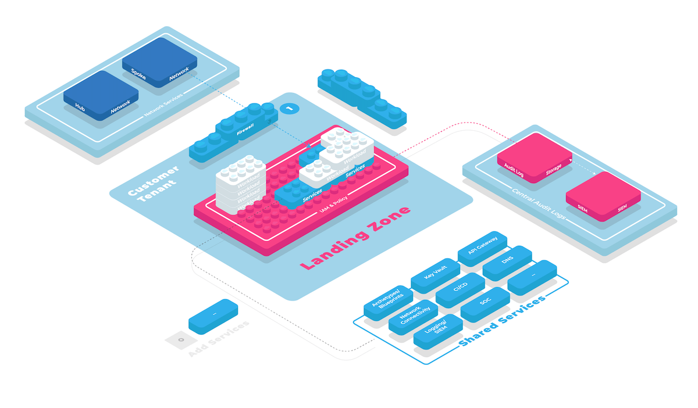

# meshcloud Landing Zone Construction Kit

Landing Zones are an architectural pattern for setting up cloud environments for multiple workloads in a scalable and secure manner.
Building Landing Zones can be a daunting task, especially when you need to provide support for a wide range of workloads
across different cloud platforms such as AWS, Azure and GCP.

The meshcloud Landing Zone Construction Kit helps you build manage the complexity of building [landing zones](https://www.meshcloud.io/2020/06/08/cloud-landing-zone-lifecycle-explained/) with a modular approach using Infrastructure as Code and GitOps. Because
it builds on terraform, you can easily leverage custom infrastructure automation as well as off-the-shelf reference
IaC landing zone implementation offered by cloud providers.



The Landing Zone Construction kit offers one solution that will help you to

- build [modular landing zones](https://cloudfoundation.meshcloud.io/maturity-model/tenant-management/modular-landing-zones.html) that empower development teams to configure their environments in self-service
- rapidly assemble and deploy landing zones for AWS, Azure and GCP using proven tools like `terraform` and `terragrunt`
- document landing zone capabilities for development teams and security auditors (self-service documentation)
- manage landing zone development lifecycle in separate development and production environments

## Getting Started

The kit is meant to be comfortably used with [collie cli](https://github.com/meshcloud/collie-cli) using a "fork and own"
approach - you will ulitmately build your own kit to meet your organizations unique requirements based on the public examples in this kit.
After installing collie, start by creating a new git repository and creating a new foundation.

```shell
git init my-foundation-kit
cd my-foundation-kit
collie foundation new my-foundation-dev
```

A foundation describes a number of cloud platforms (e.g. AWS and GCP), landing zones, cloud customers (development teams in your organization) and their cloud tenants (e.g. AWS Accounts and GCP projects).
The `collie` cli will interactively
prompt you for about the configuration settings it needs to successfully connect to your cloud platforms. After setting
up your first foundation, your repository will look like this:

```shell
$ tree
.
└── foundations
    └── my-foundation-dev
        ├── README.md
        └── platforms
            └── gcp
                └── README.md
```

Next, let's create our first kit module and apply it to our platform.

```shell
collie kit new "my-first-gcp-module"
collie kit apply "my-first-gcp-module" --foundation my-foundation-dev --platform gcp
```

This generated a new executable terraform module at `kit/my-first-gcp-module` and a terragrunt module wrapper
that simplifies executing that module (e.g. by managing common backend and provider configurations). at `foundations/my-foundation-dev/platforms/gcp`.

```shell
22:07 $ tree
.
├── foundations
│   └── my-foundation-dev
│       ├── README.md
│       └── platforms
│           └── gcp
│               ├── README.md
│               └── terragrunt.hcl
└── kit
    └── my-first-gcp-module
        ├── README.md
        ├── documentation.tf
        └── main.tf
```

Inside the kit module, you can define any reusable set of functionality that your cloud foundation needs. A common
module you will want to add to your kit is setting up organization-wide constraints at the root of the cloud
resource hierarchy. Since a kit module is a standard terraform module, you can leverage official modules
like `terraform-google-modules/org-policy/google` to set up organization policies.

After you're done with your first module, `collie` can help you deploy your cloud foundation, running `terragrunt` under transparently under the hood for you:

```shell
collie foundation deploy my-foundation
deploying (plan) foundations/my-foundation ...
deploying (plan) foundations/my-foundation/gcp ...
```

### Next Steps

To go from this simple introduction to a productive use of the landing zone construction kit we recommend reviewing
our example implementation of a cloud foundation.

- add a second (productive) cloud foundation `collie foundation new my-foundation-prod`
- review kit module usage `collie kit tree` to ensure/dev-prod parity
- build an interactive documentation for your cloud foundation using `collie docs`
- document compliance controls and their implementation using `collie compliance`

## FAQ

> Does the kit contain production-ready modules?

The kit is currently a work in progress. We will provide updates and reference module implementations soon.

> Do I have to be familiar with terraform and terragrunt to use the kit?

Yes. The kit builds on `terraform` and `terragrunt` with an opinionated workflow that lends itself to building
complex landing zones.

> Do I have to use `collie` cli for working with the kit?

Not necessarily - `collie` cli will transparently invoke other tools like terragrunt for you and offers useful utilities
to help you inspect and validate your kit and the cloud foundations built from it.
