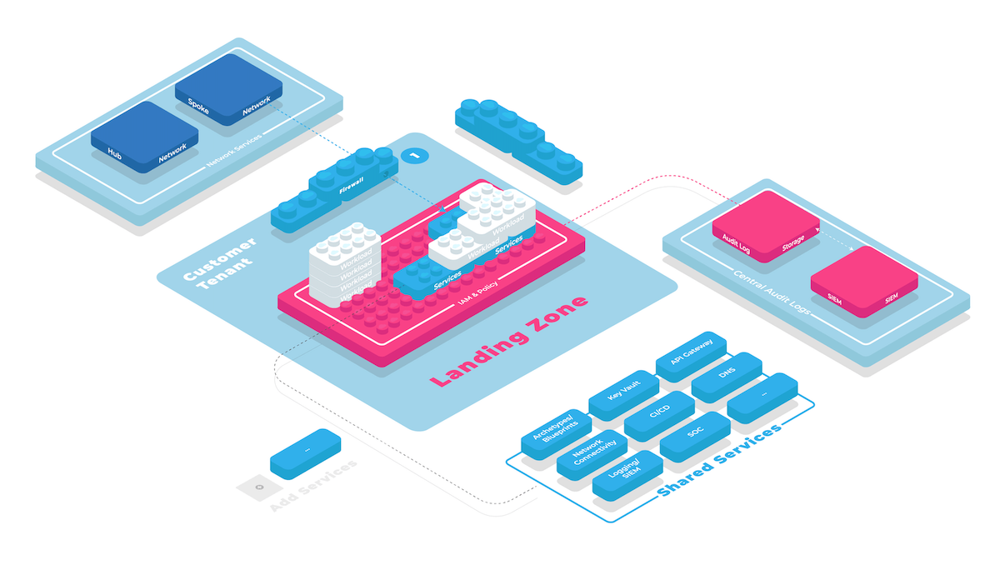

> ⚠️ **Deprecation Notice**
>
> This repository has been deprecated and is no longer actively maintained.
>
> Collie Hub previously provided a structured approach to defining and managing cloud foundations and landing zones as code, designed to work together with the Collie CLI.
>
> This functionality has since been consolidated and evolved into the **meshStack Hub**, a centralized platform for discovering and managing reusable building blocks within meshStack.
>
> 👉 Please use meshStack Hub going forward:
> - Website: https://hub.meshcloud.io
> - GitHub: https://github.com/meshcloud/meshstack-hub
>
> We recommend transitioning to meshStack Hub to benefit from ongoing development, improved usability, and full platform integration.

# Collie Hub
Collie Hub is the place to find ready-to-use kit modules that help you
build cloud landing zones for your organization and accelerate your cloud journey with [Collie CLI](https://github.com/meshcloud/collie-cli).

This repository contains:

- `/docs` the source code generating the [collie hub website](https://collie.cloudfoundation.org)
- `/kit` a collection of reusable modules implementing common best practices for building [modular landing zones](https://cloudfoundation.meshcloud.io/maturity-model/tenant-management/modular-landing-zones.html)

## Community, Discussion, Support

Collie is a 🌤️ [cloudfoundation.org community](https://cloudfoundation.org/?ref=github-collie-cli) project. Reach out to us on the [cloudfoundation.org slack](http://cloudfoundationorg.slack.com).
