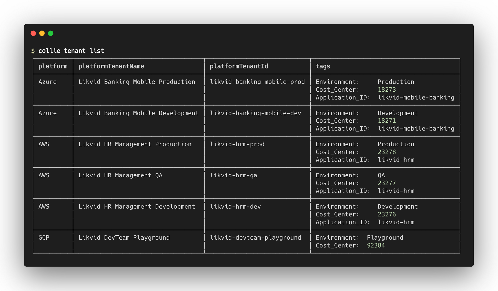
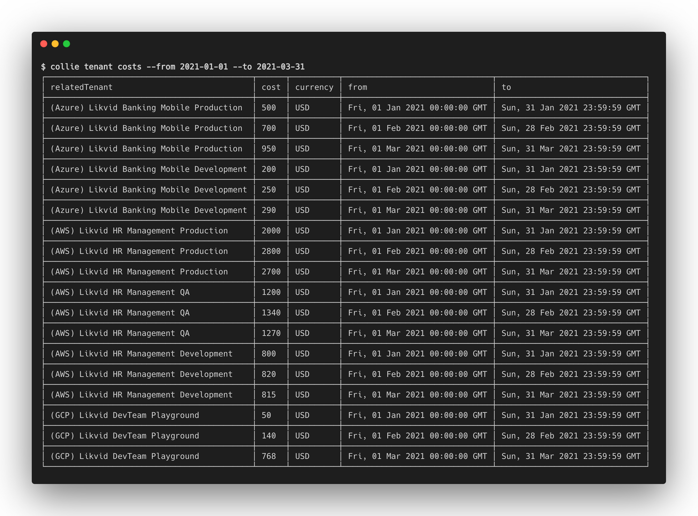
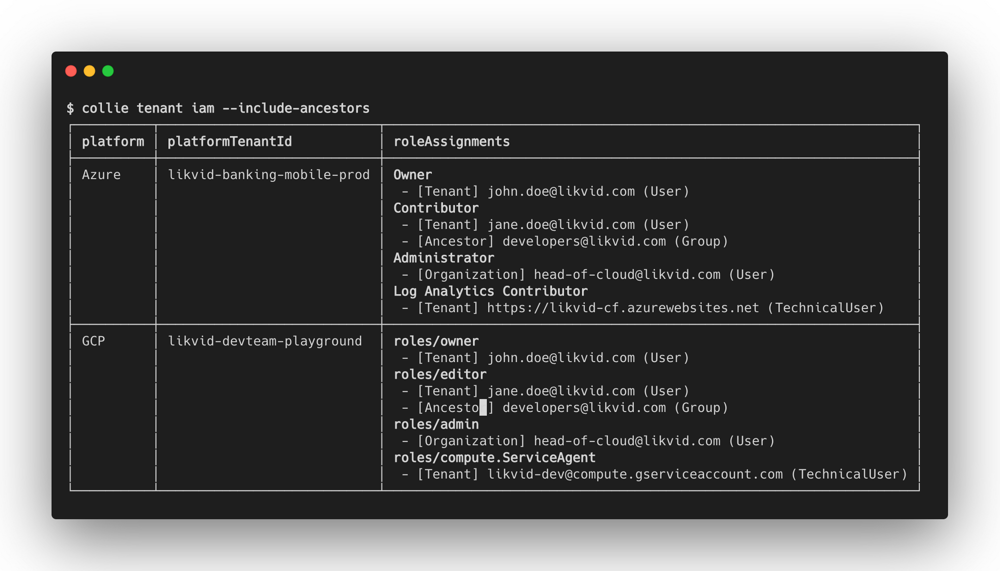

# Tenant Commands

Beyond Collie's cloud foundation building capabilities, Collie can also easily seek out key information
across multiple cloud platforms in your [foundation](./foundation.md).

## Collie's multi-cloud terminology

To make it easier and more uniform to work with all the supported cloud platforms (Azure, AWS & GCP), there is a need for a neutral language.
This section explains what neutral language Collie uses, and what it stands for in each individual cloud platform.

| Collie Term | Azure | AWS | GCP |
| ----------- | ----- | --- | --- |
| Tenants      | [Subscriptions](https://docs.microsoft.com/en-us/azure/cloud-adoption-framework/decision-guides/subscriptions/) | [Accounts](https://docs.aws.amazon.com/organizations/latest/userguide/orgs_manage_accounts.html) | [Projects](https://cloud.google.com/resource-manager/docs/creating-managing-projects) |
| Tags         | [Tags](https://docs.microsoft.com/en-us/azure/azure-resource-manager/management/tag-resources?tabs=json) | [Tags](https://docs.aws.amazon.com/organizations/latest/userguide/orgs_tagging.html) | [Labels](https://cloud.google.com/resource-manager/docs/creating-managing-labels)
| Role Assignments | [Role Assignments](https://docs.microsoft.com/en-us/azure/role-based-access-control/overview#role-assignments) | Not supported ([#41](https://github.com/meshcloud/collie-cli/issues/41)) | [IAM policies](https://cloud.google.com/iam/docs/granting-changing-revoking-access#policy-overview)
| Ancestors | [Management Groups](https://docs.microsoft.com/en-us/azure/governance/management-groups/overview) | Not supported ([#41](https://github.com/meshcloud/collie-cli/issues/41)) | [Folders](https://cloud.google.com/resource-manager/docs/creating-managing-folders)
| Organization | [Root Scope](https://cloud.google.com/resource-manager/docs/creating-managing-organization) | Not supported ([#41](https://github.com/meshcloud/collie-cli/issues/41)) | [Organization](https://cloud.google.com/resource-manager/docs/creating-managing-organization)

## Listing tenants

The most simple, but also very important functionality of Collie is listing all tenants across Azure, AWS & GCP. To do so, run the following command:

```sh
collie tenant list <foundation>
```

This should result in a table view with all tenants, including their platform, platform ID, platform name, and tags. You can also change the output format (more on that below).

The output of this command should look something like this:



## Listing cloud resource hierarhcy

Cloud tenants are part of a resource hierarchy. Quickly reviewing this hierarchy is important when developing landing zones, as this hierarchy determines how organization wide rules and policies are shared via inheritance.

```sh
collie tenant tree <foundation>
```

This should result in a `tree`-like output showing your resource hierarchy and ids (useful for `terraform import`) for your cloud platform.

```shellsession
$ collie tenant tree <foundation>
fetching tenants foundations/test/platforms/gcp ...
fetching tenants foundations/test/platforms/gcp DONE 23232ms
└─ gcp
   └─ organization 12345612
      ├─ likvid folders/493343334220
      │  ├─ likvid-dev folders/958712559912
      │  │  ├─ likvid-backend backend-develop likvid-backend-backend-de-m42
      │  │  └─ likvid-mobile develop likvid-mob-develop-mtihns7f
      │  └─ likvid-prod folders/145213092684
      │     └─ likvid-mobile production likvid-mob-production-3576w7yh
      └─ felix-cloudfun-demo-20210223 felix-cloudfun-demo-20210223
```

## Listing costs

To enrich the information per tenant, you can list the cost per month, per tenant. To do so, run the following command (this will list costs for the first quarter of 2021)

```sh
collie tenant cost <foundation> --from 2021-01-01 --to 2021-03-31
```

This will give you a table view with all tenants, with the costs made per month.

An example output of this command should look something like this:



**Note for GCP platforms** Cost reporting on GCP requires setting up a [BigQuery billing export](https://cloud.google.com/billing/docs/how-to/export-data-bigquery) and a special view, as well as configuring how to access it in your foundation's [GCP platform config](./foundation.md#gcp). The recommended way to set this up is via the [gcp/admin/billing-account kit module](./../modules/gcp/admin/billing-account/README.md).

::: tip
When exporting this information as CSV, you will get the tags of a tenant as columns. This makes it very handy to import and analyze in a dashboard tool such as PowerBI or Google Data Studio to see the costs per tag, and answering questions such as e.g. what did I spend on development environments in the last month?
:::

## Listing IAM configuration

To see who or what has access to a tenant, you can use the IAM listing functionality of Collie. You can do so by running this command:

```sh
collie tenant iam <foundation>
```

After running this command, it will show you the IAM role assignments that are directly applied to the tenant. You can see what roles are assigned and to whom.

It is also possible to see the inherited IAM from ancestors, such as Azure Management Groups & GCP Folders. To do so, add the following flag to the command:

```sh
collie tenant iam <foundation> --include-ancestors
```

An example output of this command should look something like this:



## Identifying inconsistencies in the use of tags

To get a better grip on the consistency of the use of tags, Collie also offers the ability to see what percentage of tags is used by all cloud tenants. You can do so by running the following command:

```sh
collie tenant <foundation> analyze-tags
```

When curious about which tenants are missing a particular tag, it is possible to view more details of one or more tags. You can do so by running the following command: (in this case for the `CostCenter` tag)

```sh
collie tenant analyze-tags --details --tags CostCenter
```

An example output of this command should look something like this:


## Changing output formats

Every command mentioned above supports changing the output format of the command. By default, it will always be shown in a command line-friendly table, but there are also other options. The supported output formats are `table` (default), `csv`, `json`, and `yaml`. For example:

```sh
collie tenant list <foundation> --output <format>
# or
collie tenant list <foundation> -o <format>
```

## Cache

As Collie will deal with a lot of data, it supports caching to make requests faster. By default, the cache is valid for 24 hours and will invalidate itself upon a new request after 24 hours have expired.

The cache will be stored in your [collie repository](./repository.md) under `foundations/$foundation-id/platforms/$platform-id/tenants/.collie-cache`.

::: tip
You should add `.collie-cache` to your `.gitignore`. Collie does this by default for repositories generated with `collie init`.
:::

To force collie to refresh the cache when executing a tenant command, simply append the `--refresh` flag.

```sh
collie tenant list <foundation> --refresh
```
