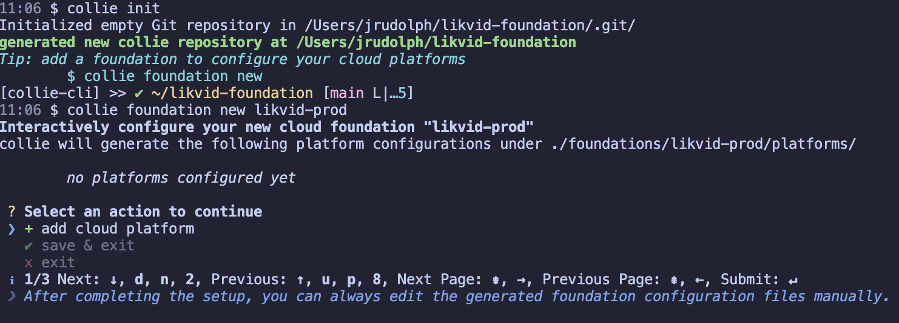
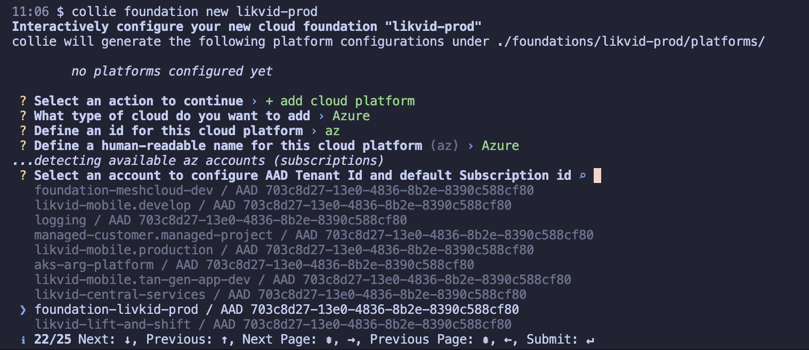

# Start your Cloud Foundation

This series of tutorials will lead you through the steps to get started with collie. This first tutorial will show you to

- initialize a new repository to work with collie
- add your first cloud platform
- create and review documentation for your cloud foundation

Throughout our tutorials, we are goin to use "Livkid Bank" as the name of a fictional organization that we are building a cloud foundation for.

## Verify Collie Installation

Let's first review whether we have collie and the dependencies on other tools that we are going to need correctly installed.

```text
$ collie info
collie v0.17.0

Runtime:
deno 1.34.2 x86_64-apple-darwin

Installed dependencies:
aws 2.12.6
az 2.49.0
gcloud 433.0.1
git 2.38.1
terraform v1.5.2
terragrunt v0.48.0
terraform-docs v0.16.0
npm 9.5.1
```

:::tip
Depending on the cloud platforms you plan on working with, you may not need all of `aws`, `az` and `gcloud` installed.
:::

The other tools are however required to use all of collie's capabilities. If one of the tools lists as *not installed* or *unsupported version*, please review the [installation instructions]((https://github.com/meshcloud/collie-cli#-installation)) to fix this.

When all tools are correctly installed and detected by collie, we can continue with the next step.

## Initialize Collie Repository

Collie manages all of your cloud platforms and landing zone configurations in a git repository called a [collie repository](../reference/repository.md).

Let's create this repository using the following commands.

```sh
# Create a folder for your foundation 
mkdir -p likvid-foundation && cd likvid-foundation

# Initialize a collie git repository
collie init
```

### Create a Foundation

After running this command, let's create a new cloud foundation. We will call this `livkid-prod`.

Let's run `collie foundation new likvid-prod` to start an interactive configuration for this foundation.



### Add a platform

Follow the interactive prompt `+ add cloud platform` and select the type of cloud platform you want to add (AWS, Azure or GCP). Then follow the instructions to complete the configuration.



After completing the prompts, chose `✔ save & exit` to persist this configuration in your collie repository.

### Review

After completing these steps, let's now review the structure of our collie repository:

```text
$ tree
.
├── README.md
├── compliance
├── foundations
│   └── likvid-prod
│       ├── README.md
│       └── platforms
│           └── az
│               └── README.md
└── kit
    └── README.md

6 directories, 4 files
```

As you can see our platform has a 1:1 representation in the filesystem under `foundations/likvid-prod/platforms/az/README.md`.

If we open that file we will see that it contains markdown with some structured yaml metadata in the beginning (called a frontmatter).

```markdown
---
id: az
name: Azure
azure:
  aadTenantId: 703c8d27-13e0-4836-8b2e-8390c588cf80
  subscriptionId: 9809209b-869e-4f5c-8d86-c8b71294153f
cli:
  az: {}

---

# Azure
  
This Azure platform is set up in AAD Tenant 703c8d27-13e0-4836-8b2e-8390c588cf80.
```

This directory structure of the collie repository and these markdown files are how collie stores all of its data about your cloud foundation.

## Next Steps

:::tip
Now is a good time to commit your changes to git 

```sh
git add . && git commit -m "initialized livkid-prod"
```

:::

In the next tutorial, we are going to learn how to deploy our first kit module to our cloud platform.
