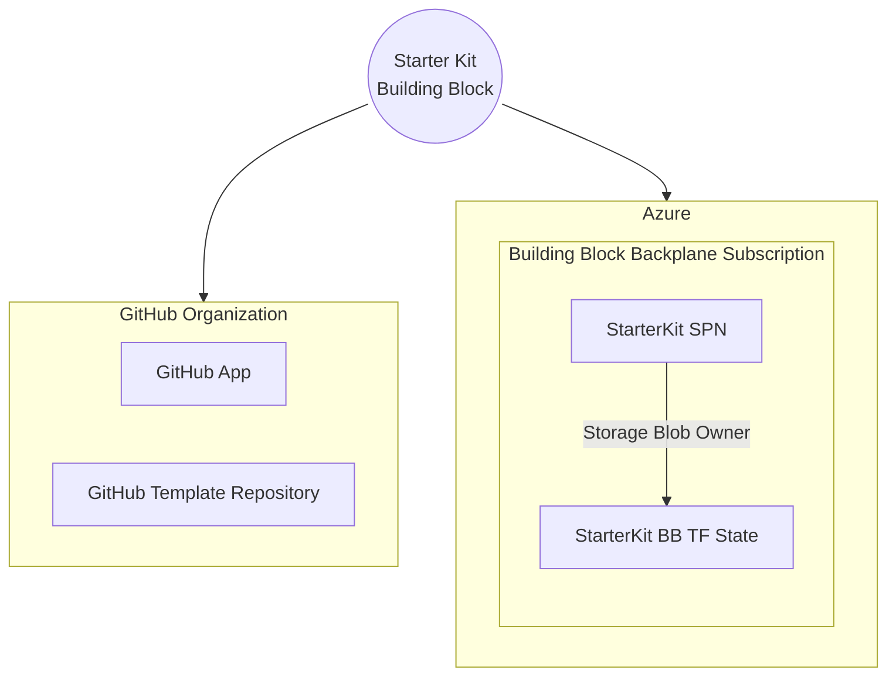
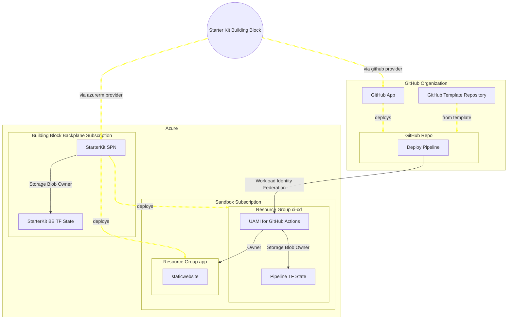
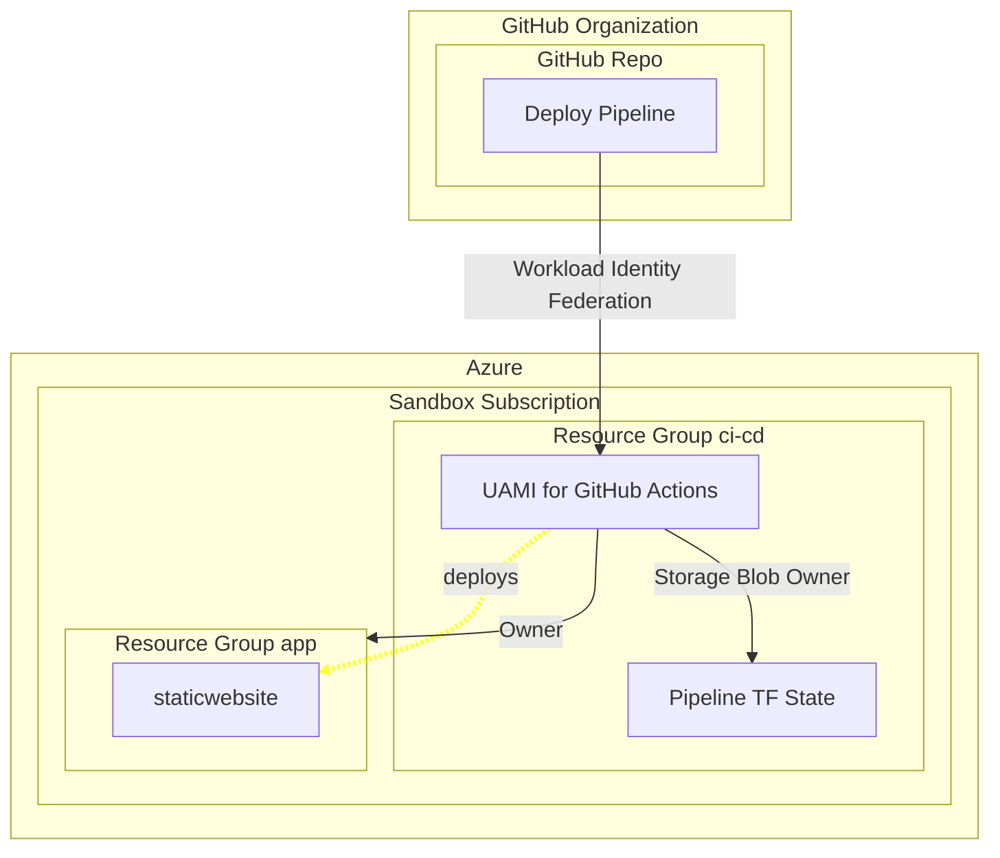

# Starter Kits

This is an implementation of "Cloud Starter Kits" that provides application teams with

- a GitHub repository, seeded with an application starter kit
- a GitHub actions pipeline
- a service account solution that enables the GitHub actions pipeline to deploy to their Azure Subscription

## Prerequisites

### GitHub App

Apart from an Azure Landing Zone (we recommend using starter kits only with Sandbox Landing Zones) you will need a
GitHub organization and the ability to [create and install a private GitHub App](https://docs.github.com/en/apps/creating-github-apps/registering-a-github-app/registering-a-github-app) on the organization. This app will need the following permissions

- Permissions
  -  `Read access to metadata and organization administration`
  - ` Read and write access to actions, administration, code, secrets, and workflows`
- Repository access: `All repositories`

You will also need to generate a private key `.PEM` file for the app to be used by the [github terraform provider](https://registry.terraform.io/providers/integrations/github/latest/docs#github-app-installation) when deploying instances of the `buildingblock/` module.

### Template Repository

You will also need a template repository that contains code and GitHub actions pipelines. The "official example"
that we use for testing is [likvid-bank/starterkit-template-azure-static-website](https://github.com/likvid-bank/starterkit-template-azure-static-website).
This template sets up an Azure Static Website including a PR workflow for terraform and code.

## Structure of this Kit module

This kit module comes with three components, each responsible for enabling deployment of the next

- the kit module itself, acting as the building block's "backplane" that sets up all required infrastructure for deploying starterkits for application teams
- a terraform module that forms the definition for each "building block", i.e. the instance of the starterkit deployed for a particular application team including a GitHub repo and GitHub actions pipeline
- terraform code that lives in the starterkit template, deployed by a GitHub actions pipeline

The following sections explain these parts in more detail

### Deployment of the Building Block backplane

Before we can deploy building blocks, we need to first set up the backplane. This operation is only performed once by deploying this kit module using collie as any other kit module with `collie kit apply` and `collie foundation deploy`.

> Unforutnately it's currently not possible to setup a GitHub app via terraform, so please perform this manually.

This will deploy the following resources:

### Deployment of a Building Block

Now that we the backplane deployed, we can use the backplane to deploy an instance of the [buildingblock](./buildingblock/) terraform module into a sandbox subscription supplied by the application team.
The easiest way to do this is to create a building block definition from the `buildingblock` terraform module in meshStack and configure it with the `config_tf` file produced by the backplane module.

The chart below shows the interaction of cloud resources when deploying a new building block using the backplane:

## Deployment of the App

Now that we have the application team's sandbox subscription and their GitHub repository configured, the team can use the setup to deploy their `staticwebsite` app.

## Creating Custom Starter Kits

Using this kit module as a template, you can quickly develop similar starter kits.
You will typically only need to customize the template repository with code and GitHub Actions workflows.

For advanced use cases, you can of course also want to customize the `buildingblock/` terraform module itself or even the backplane terraform module.
<!-- BEGIN_TF_DOCS -->
## Requirements

| Name | Version |
|------|---------|
|  [terraform](#requirement\_terraform) | >= 1.0 |
|  [azuread](#requirement\_azuread) | 3.0.2 |
|  [azurerm](#requirement\_azurerm) | 3.116.0 |
|  [github](#requirement\_github) | 5.42.0 |
|  [random](#requirement\_random) | 3.6.0 |
|  [time](#requirement\_time) | 0.11.1 |

## Modules

No modules.

## Resources

| Name | Type |
|------|------|
| [azuread_app_role_assignment.starterkit-directory](https://registry.terraform.io/providers/hashicorp/azuread/3.0.2/docs/resources/app_role_assignment) | resource |
| [azuread_application.starterkit](https://registry.terraform.io/providers/hashicorp/azuread/3.0.2/docs/resources/application) | resource |
| [azuread_service_principal.starterkit](https://registry.terraform.io/providers/hashicorp/azuread/3.0.2/docs/resources/service_principal) | resource |
| [azuread_service_principal_password.starterkit](https://registry.terraform.io/providers/hashicorp/azuread/3.0.2/docs/resources/service_principal_password) | resource |
| [azurerm_resource_group.tfstates](https://registry.terraform.io/providers/hashicorp/azurerm/3.116.0/docs/resources/resource_group) | resource |
| [azurerm_role_assignment.starterkit_access](https://registry.terraform.io/providers/hashicorp/azurerm/3.116.0/docs/resources/role_assignment) | resource |
| [azurerm_role_assignment.terraform_state](https://registry.terraform.io/providers/hashicorp/azurerm/3.116.0/docs/resources/role_assignment) | resource |
| [azurerm_role_definition.starterkit_access](https://registry.terraform.io/providers/hashicorp/azurerm/3.116.0/docs/resources/role_definition) | resource |
| [azurerm_role_definition.starterkit_deploy](https://registry.terraform.io/providers/hashicorp/azurerm/3.116.0/docs/resources/role_definition) | resource |
| [azurerm_storage_account.tfstates](https://registry.terraform.io/providers/hashicorp/azurerm/3.116.0/docs/resources/storage_account) | resource |
| [azurerm_storage_container.tfstates](https://registry.terraform.io/providers/hashicorp/azurerm/3.116.0/docs/resources/storage_container) | resource |
| [github_repository.staticwebsite_template](https://registry.terraform.io/providers/integrations/github/5.42.0/docs/resources/repository) | resource |
| [random_string.resource_code](https://registry.terraform.io/providers/hashicorp/random/3.6.0/docs/resources/string) | resource |
| [time_rotating.key_rotation](https://registry.terraform.io/providers/hashicorp/time/0.11.1/docs/resources/rotating) | resource |
| [azuread_application_published_app_ids.well_known](https://registry.terraform.io/providers/hashicorp/azuread/3.0.2/docs/data-sources/application_published_app_ids) | data source |
| [azuread_group.project_admins](https://registry.terraform.io/providers/hashicorp/azuread/3.0.2/docs/data-sources/group) | data source |
| [azuread_service_principal.msgraph](https://registry.terraform.io/providers/hashicorp/azuread/3.0.2/docs/data-sources/service_principal) | data source |
| [azurerm_subscription.current](https://registry.terraform.io/providers/hashicorp/azurerm/3.116.0/docs/data-sources/subscription) | data source |

## Inputs

| Name | Description | Type | Default | Required |
|------|-------------|------|---------|:--------:|
|  [github\_app\_id](#input\_github\_app\_id) | id of your GitHub App | `number` | n/a | yes |
|  [github\_app\_installation\_id](#input\_github\_app\_installation\_id) | id of your GitHub App installation as it appears in URLs on GitHub.com | `number` | n/a | yes |
|  [github\_org](#input\_github\_org) | id of your GitHub organization as it appears in URLs on GitHub.com | `string` | n/a | yes |
|  [location](#input\_location) | Azure location for deploying the building block terraform state storage account | `string` | n/a | yes |
|  [scope](#input\_scope) | Scope where the building block should be deployable, typically a Sandbox Landing Zone Management Group | `string` | n/a | yes |

## Outputs

| Name | Description |
|------|-------------|
|  [config\_tf](#output\_config\_tf) | Generates a config.tf that can be dropped into meshStack's BuildingBlockDefinition as an encrypted file input to configure this building block. |
|  [documentation\_md](#output\_documentation\_md) | n/a |
<!-- END_TF_DOCS -->